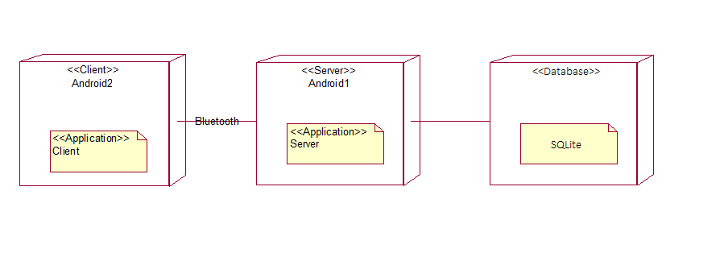

# Часть 1
## 1. Тип приложения
Приложение для мобильных устройств на операционной системе Android 
## 2.Стратегия развертывания
 Развертывание клиент-сервер
## 3. Технологии
Java-сильно типизированный объектно-ориентированный язык программирования, разработанный компанией Sun Microsystems.
Android-официальная среда разработки под Android.
SQLite-компактная встраиваемая СУБД.
## 4. Параметры качества
* Простота добавления новой функциональности(удобство и простота обслуживания)
* Многопользовательская игра работает при включенном Bluetooth (доступность)
* Система может поддерживать до 4 пользователей(масштабируемость)
* Легко составить критерии проверки и протестировать приложение в ходе использования(тестируемость)
## 5. Сквозная функциональность
* Управление исключениями: обеспечить стабильность состояния приложения после сбоя.
* Сетевое взаимодействие: использовать Bluetooth протоколы.
* Кэширование: сохранять данные об игроках(их положение на доске, количество денег, предприятия) в общем хранилище, реализованом с помощью SQLite
## "To be" архитектура:

# Часть 2
## "As is" архитектура:
1.Диаграмма развертывания

2.Диаграмма классов

# Часть 3
На данном этапе реализован функционал приложения, за который отвечает сервер. Необходимо реализовать связь клиент-сервер и функционал клиента.
