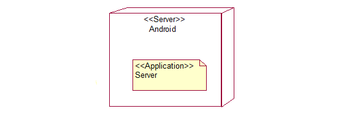

# Часть 1
## 1. Тип приложения
Приложение для мобильных устройств на операционной системе Android 
## 2.Стратегия развертывания
 3-уровневое развертывание
## 3. Технологии
* Java-сильно типизированный объектно-ориентированный язык программирования, разработанный компанией Sun Microsystems.
* Android Studio-официальная среда разработки под Android.
## 4. Параметры качества
* Простота добавления новой функциональности(удобство и простота обслуживания)
* Многопользовательская игра работает при включенном Bluetooth (доступность)
* Система может поддерживать до 4 пользователей(масштабируемость)
* Легко составить критерии проверки и протестировать приложение в ходе использования(тестируемость)
## 5. Сквозная функциональность
* Управление исключениями: обеспечить стабильность состояния приложения после сбоя.
* Сетевое взаимодействие: использовать Bluetooth протоколы.
* Кэширование: сохранять данные об игроках(их положение на доске, количество денег, предприятия) в общем хранилище, реализованом с помощью SQLite
## "To be" архитектура:

# Часть 2
## "As is" архитектура:
1.Диаграмма развертывания

2.Диаграмма классов

# Часть 3
Отличия "As is" и "To be":
На данном этапе реализован только функционал серверной части. Это было сделано основываясь на принцип "Минимизируйте проектирование наперёд", так как реализация клиента и базы данных пока не требовалась. Функционал клиента и базы данных будут реализованы в 3 спринте.
[User Story для клиента, который выполняет подключение](https://trello.com/c/uwzee0TQ/13-%D0%BC%D0%BD%D0%BE%D0%B3%D0%BE%D0%BF%D0%BE%D0%BB%D1%8C%D0%B7%D0%BE%D0%B2%D0%B0%D1%82%D0%B5%D0%BB%D1%8C%D1%81%D0%BA%D0%B0%D1%8F-%D0%B8%D0%B3%D1%80%D0%B0), [User Story для базы данных](https://trello.com/c/asx2d8te/16-%D0%B1%D0%B0%D0%B7%D0%B0-%D0%B4%D0%B0%D0%BD%D0%BD%D1%8B%D1%85))
При реализации приложения был использован принцип "Единственности ответственности": за каждую совокупность функций отвечает свой отдельный класс. Примером применения данного принципа является наша диаграмма классов.
Пути улучшения архитектуры:
* Принцип разделения функций([User Story для клиента, который выполняет подключение](https://trello.com/c/uwzee0TQ/13-%D0%BC%D0%BD%D0%BE%D0%B3%D0%BE%D0%BF%D0%BE%D0%BB%D1%8C%D0%B7%D0%BE%D0%B2%D0%B0%D1%82%D0%B5%D0%BB%D1%8C%D1%81%D0%BA%D0%B0%D1%8F-%D0%B8%D0%B3%D1%80%D0%B0), [User Story для сервера с основным функционалом игры](https://trello.com/c/lK9U1XWI/15-%D1%81%D0%BE%D0%B7%D0%B4%D0%B0%D0%BD%D0%B8%D0%B5-%D0%BC%D0%BD%D0%BE%D0%B3%D0%BE%D0%BF%D0%BE%D0%BB%D1%8C%D0%B7%D0%BE%D0%B2%D0%B0%D1%82%D0%B5%D0%BB%D1%8C%D1%81%D0%BA%D0%BE%D0%B9-%D0%B8%D0%B3%D1%80%D1%8B), [User Story для базы данных](https://trello.com/c/asx2d8te/16-%D0%B1%D0%B0%D0%B7%D0%B0-%D0%B4%D0%B0%D0%BD%D0%BD%D1%8B%D1%85)).
